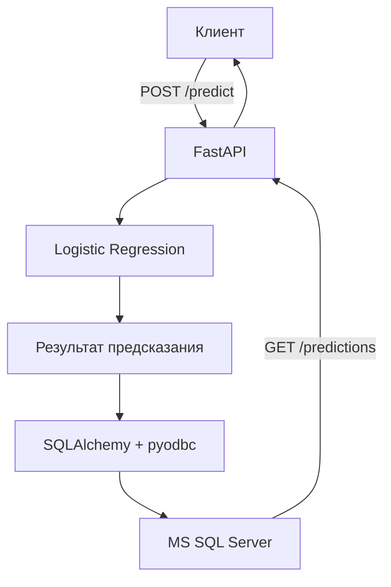

# Banknote Authentication Service with MS SQL Server

Лабораторная работа №2 по дисциплине «Инфраструктура больших данных». Проект продолжает ML-сервис из первой лабораторной и добавляет взаимодействие с Microsoft SQL Server согласно варианту №4.

Сервис принимает числовые характеристики банкноты, выполняет бинарную классификацию с помощью обученной модели Logistic Regression и сохраняет входные признаки вместе с результатом предсказания в базу данных.

## Возможности проекта

- подготовка и разделение данных;
- обучение и сохранение модели Logistic Regression;
- REST API на FastAPI;
- сохранение истории предсказаний в MS SQL Server;
- получение сохранённых предсказаний через API;
- передача параметров подключения через переменные окружения;
- модульные и функциональные тесты;
- версионирование данных и модели с помощью DVC;
- запуск API и базы данных через Docker Compose;
- автоматизация CI/CD с помощью GitHub Actions;
- публикация образа API в DockerHub.

## Датасет

Используется датасет [Bank Note Authentication UCI Data](https://www.kaggle.com/datasets/ritesaluja/bank-note-authentication-uci-data).

Датасет содержит 1372 наблюдения. Признаки получены в результате вейвлет-преобразования изображений банкнот. Целевая переменная определяет подлинность банкноты.

| Поле | Описание |
| --- | --- |
| `variance` | дисперсия преобразованного изображения |
| `skewness` | асимметрия преобразованного изображения |
| `curtosis` | эксцесс преобразованного изображения |
| `entropy` | энтропия изображения |
| `class` | целевой класс: `0` — подлинная, `1` — поддельная |

Во время предобработки удаляются дубликаты. После очистки остаётся 1348 объектов. Данные разделяются на обучающую и тестовую выборки в отношении 70/30 с сохранением соотношения классов (`stratify=y`). Для воспроизводимости используется `random_state=0`.

## Архитектура решения



Приложение запускается в двух контейнерах:

| Сервис | Назначение | Порт |
| --- | --- | ---: |
| `api` | FastAPI, ML-модель и слой доступа к данным | `8000` |
| `mssql` | Microsoft SQL Server 2022 | `1433` |

Docker Compose создаёт общую сеть, в которой API обращается к базе по адресу `mssql:1433`. Данные SQL Server сохраняются в именованном томе `mssql-data` и не теряются при обычном пересоздании контейнера.

Для подключения используется цепочка:

```text
SQLAlchemy → pyodbc → Microsoft ODBC Driver 18 → MS SQL Server
```

## Хранение предсказаний

При первом обращении приложение создаёт базу `banknote` и таблицу `predictions`, если они ещё не существуют.

| Столбец | Тип данных | Назначение |
| --- | --- | --- |
| `id` | `INTEGER IDENTITY` | уникальный идентификатор записи |
| `variance` | `FLOAT` | входной признак |
| `skewness` | `FLOAT` | входной признак |
| `curtosis` | `FLOAT` | входной признак |
| `entropy` | `FLOAT` | входной признак |
| `prediction` | `INTEGER` | предсказанный класс `0` или `1` |
| `label` | `VARCHAR(20)` | `authentic` или `forged` |
| `created_at` | `DATETIME` | время сохранения результата |

## Структура проекта

```text
bd-lab-2/
├── .github/workflows/
│   ├── ci.yml                         # сборка, unit-тесты и публикация образа
│   └── cd.yml                         # Docker Compose и функциональные тесты
├── experiments/
│   └── log_reg.sav.dvc                # DVC-метаданные обученной модели
├── notebooks/
│   └── BankNote_classification.ipynb
├── src/
│   ├── unit_tests/                    # модульные тесты
│   ├── api.py                         # FastAPI-приложение
│   ├── database.py                    # подключение и работа с MS SQL Server
│   ├── logger.py                      # настройка логирования
│   ├── predict.py                     # загрузка модели и предсказание
│   ├── preprocess.py                  # очистка и разделение данных
│   └── train.py                       # обучение Logistic Regression
├── tests/
│   ├── predictions.json               # сценарии предсказаний
│   ├── routes.json                    # сценарии маршрутов
│   ├── validation.json                # сценарии валидации
│   ├── run_scenario.py                # базовые функциональные сценарии
│   └── test_database_scenario.py      # сценарий сохранения в настоящую БД
├── .env.example                       # шаблон переменных окружения
├── config.ini                         # пути к данным и модели
├── data.dvc                           # DVC-метаданные датасета
├── docker-compose.yml
├── Dockerfile
├── requirements.txt
└── scenario.json                      # конфигурация сценариев
```

Файлы датасета и обученной модели не хранятся непосредственно в Git. Репозиторий содержит `.dvc`-файлы, по которым DVC получает соответствующие версии артефактов из удалённого хранилища.

## Настройка и запуск

### 1. Клонирование репозитория

```bash
git clone https://github.com/Sapushiro/bd-lab-2.git
cd bd-lab-2
```

### 2. Получение данных и модели

Установите зависимости и загрузите DVC-артефакты:

```bash
python3 -m venv .venv
source .venv/bin/activate
python -m pip install --upgrade pip
python -m pip install -r requirements.txt
dvc pull -r origin
```

Для доступа к удалённому DVC-хранилищу необходима локальная авторизация DagsHub.

### 3. Настройка переменных окружения

Создайте `.env` на основе шаблона:

```bash
cp .env.example .env
```

Заполните переменные:

```env
MSSQL_SA_PASSWORD=change_me
DB_HOST=mssql
DB_PORT=1433
DB_NAME=banknote
DB_USER=sa
DB_PASSWORD=change_me
```

Пароль SQL Server должен содержать не менее восьми символов, буквы в верхнем и нижнем регистре, цифры и специальные символы. Файл `.env` добавлен в `.gitignore` и не должен попадать в репозиторий.

### 4. Запуск через Docker Compose

```bash
docker compose up -d --build
```

Проверка состояния:

```bash
docker compose ps
```

После успешного запуска оба сервиса должны иметь состояние `healthy`. Swagger UI доступен по адресу [http://localhost:8000/docs](http://localhost:8000/docs).

Остановка без удаления данных:

```bash
docker compose down
```

Остановка с удалением тестового тома и всех данных SQL Server:

```bash
docker compose down -v
```

## REST API

### `GET /health`

Проверяет доступность API.

```json
{
  "status": "ok"
}
```

### `POST /predict`

Выполняет классификацию и сохраняет запрос вместе с результатом в таблице `predictions`.

```bash
curl -X POST http://localhost:8000/predict \
  -H "Content-Type: application/json" \
  -d '{
    "variance": 3.6216,
    "skewness": 8.6661,
    "curtosis": -2.8073,
    "entropy": -0.44699
  }'
```

Ответ:

```json
{
  "prediction": 0,
  "label": "authentic"
}
```

### `GET /predictions`

Возвращает историю предсказаний из MS SQL Server. Новые записи располагаются первыми.

```bash
curl http://localhost:8000/predictions
```

Пример ответа:

```json
[
  {
    "id": 1,
    "variance": 3.6216,
    "skewness": 8.6661,
    "curtosis": -2.8073,
    "entropy": -0.44699,
    "prediction": 0,
    "label": "authentic",
    "created_at": "2026-09-03T17:56:54.520000"
  }
]
```

Если обязательное поле отсутствует, имеет неверный тип или запрос содержит неизвестное поле, `/predict` возвращает `422 Unprocessable Entity`.

## Подготовка данных и обучение

Предобработка:

```bash
python -m src.preprocess
```

Обучение:

```bash
python -m src.train
```

Обученная модель сохраняется в `experiments/log_reg.sav`.

Для классификации используется `LogisticRegression` из scikit-learn. На тестовой выборке получены результаты:

| Метрика | Значение |
| --- | ---: |
| Accuracy | `0.9975` |
| Верных предсказаний | `404 из 405` |

Матрица ошибок:

```text
[[216   1]
 [  0 188]]
```

## Тестирование

### Модульные тесты

Модульные тесты используют `unittest`, `TestClient` и подмену FastAPI-зависимостей через `dependency_overrides`. Внешние компоненты модели и базы заменяются объектами `Mock`, поэтому unit-тесты не требуют запуска SQL Server.

Проверяются:

- подготовка данных;
- обучение и сохранение модели;
- формирование предсказаний;
- маршрутизация и валидация API;
- передача результата в слой базы данных;
- преобразование ORM-записей в JSON.

Всего реализовано 30 модульных тестов.

```bash
python -m unittest discover \
  -s src/unit_tests \
  -p "test_*.py" \
  -v
```

### Функциональные тесты

Базовые функциональные сценарии:

```bash
python tests/run_scenario.py
```

Сценарий взаимодействия с настоящей базой:

```bash
python tests/test_database_scenario.py -v
```

Он проверяет полную цепочку:

```text
POST /predict → ML-модель → INSERT в SQL Server
→ GET /predictions → проверка сохранённой записи
```

В CD выполняются 11 базовых сценариев и один сценарий сохранения предсказания в MS SQL Server. Все результаты записываются в `functional-test-results.txt` и публикуются как артефакт GitHub Actions.

## Docker

Образ API собирается из `Dockerfile` на основе `python:3.12-slim-bookworm`. Внутрь устанавливаются Microsoft ODBC Driver 18, `pyodbc`, SQLAlchemy, зависимости Python, исходный код и обученная модель.

SQL Server запускается из официального образа:

```text
mcr.microsoft.com/mssql/server:2022-latest
```

В `docker-compose.yml` настроены:

- два сервиса `api` и `mssql`;
- общая сеть Compose;
- именованный том `mssql-data`;
- healthcheck SQL Server через `sqlcmd` и `SELECT 1`;
- healthcheck API через `GET /health`;
- запуск API после перехода базы в состояние `healthy`.

Опубликованный образ API: [sapushiro/banknote-api-lab2](https://hub.docker.com/r/sapushiro/banknote-api-lab2).

## DVC и DagsHub

DVC используется для версионирования директории `data/` и обученной модели `experiments/log_reg.sav`. Во второй лабораторной переиспользуются артефакты первой лабораторной из [DagsHub](https://dagshub.com/Sapushiro/bd-lab-1).

Для GitHub Actions применяются secrets:

```text
DAGSHUB_USERNAME
DAGSHUB_TOKEN
```

## CI/CD

### Continuous Integration

Workflow `.github/workflows/ci.yml` запускается при создании Pull Request в `main` или вручную. Он:

1. получает исходный код;
2. устанавливает DVC;
3. загружает данные и модель из DagsHub;
4. собирает Docker-образ API;
5. запускает 30 модульных тестов внутри контейнера;
6. публикует образ `sapushiro/banknote-api-lab2` в DockerHub с тегами `latest` и SHA коммита.

### Continuous Delivery

Workflow `.github/workflows/cd.yml` запускается после успешного CI или вручную. Он:

1. создаёт временный `.env` из GitHub Secrets;
2. загружает готовый образ API из DockerHub;
3. запускает API и MS SQL Server через Docker Compose;
4. дожидается успешных healthcheck;
5. выполняет базовые сценарии API;
6. проверяет сохранение предсказания в настоящем SQL Server;
7. публикует `functional-test-results.txt` как артефакт;
8. выводит логи при ошибке;
9. удаляет тестовые контейнеры и volume.

Используемые GitHub Secrets:

```text
DAGSHUB_USERNAME
DAGSHUB_TOKEN
DOCKERHUB_USERNAME
DOCKERHUB_TOKEN
MSSQL_SA_PASSWORD
```

Значения секретов в репозитории не хранятся.

## Итог

В результате сервис модели интегрирован с MS SQL Server согласно варианту №4. Входные признаки и результаты классификации сохраняются в базе данных, а история доступна через REST API. Приложение и база запускаются как два связанных контейнера, параметры доступа передаются через переменные окружения, а сборка, публикация и функциональная проверка автоматизированы в CI/CD.

## Ссылки

- [GitHub-репозиторий](https://github.com/Sapushiro/bd-lab-2)
- [Датасет на Kaggle](https://www.kaggle.com/datasets/ritesaluja/bank-note-authentication-uci-data)
- [DagsHub-хранилище](https://dagshub.com/Sapushiro/bd-lab-1)
- [DockerHub-образ](https://hub.docker.com/r/sapushiro/banknote-api-lab2)
